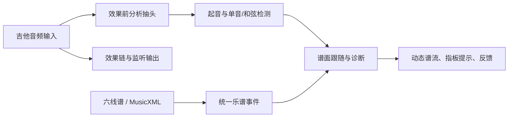

# Plan: 实时曲谱跟弹与诊断

| Field | Value |
|-------|-------|
| Status | in-progress |
| Created | 2026-10-04 |
| Ticket | N/A |
| Branch | main |

## Context

现有本地升级已提供指板、单音检测、ASCII 六线谱与 MusicXML 解析、滚动谱流，但误判强泛音、漏掉部分 MusicXML 音符，跟弹只按音高顺序前进。目标是让演奏者从音频接口输入吉他时获得可靠的单音/和弦、节奏与时值反馈，谱面按实际弹奏位置流转。保留当前无构建步骤的浏览器架构；此前用户要求的公开试玩在全部验收后更新。

## Architecture Decisions

- 实时音频仍在浏览器本地处理；Python 只做现有离线深度分析。
- 单音检测使用短窗周期估计，结果必须能拒绝噪声和多音；所有判定用“实际发声音高”的 MIDI 语义。
- 跟弹提供自由跟弹与节拍跟弹。自由模式由弹奏驱动谱面，可指出错音、漏音和音准；只有节拍模式以可观察的起始时钟判定早晚、时值。
- 和弦按可辨认的目标音集合判定，音频不足以证明具体弦与品位时显示“不确定”，不把一个音算整和弦。
- 演奏检测时间来自起音事件，不使用稳定后的显示时间；用户可调输入延迟补偿。

## Diagrams

## Milestones Overview

1. **听清弹奏** — 单音、起音与和弦检测具备可信的置信度和时间戳。
2. **读准乐谱** — 将六线谱与 MusicXML 规范化为可播放、可判定的事件。
3. **跟随并指导** — 谱面随演奏定位，自由与节拍模式反馈音高、节奏和时值。

---

## Milestone 1: 听清弹奏

**Why this matters:** 演奏者需要系统先听对音，后续对错反馈才可信。

**Success criteria:** 强二次泛音的 E2 不误报成 E3；静音、噪声与和弦不冒充高置信单音；重弹有独立起音事件。

**Key decisions:** 用短窗周期估计处理单音；和弦只对谱面已知目标做保守频谱证据检测。

### Deliverable Spec

| API | Input | Output |
|-----|-------|--------|
| `DSP.detectPitch` | PCM、采样率、门限 | 音高、音量、周期置信度或 `null` |
| `DSP.detectChord` | PCM、采样率、目标 MIDI | 已检测/缺失/不确定的目标音 |
| 训练器起音事件 | PCM 电平变化 | 起音时间、稳定音高、音分偏差 |

### 1.1 [ ] 改进测音并加入确定性信号测试
- **Files:** `js/dsp.js`, `tests/dsp.test.cjs`
- **What:** 短窗周期估计、缓冲复用、噪声拒绝；用合成吉他谐波、纯音、静音、和弦验证。
- **Acceptance:** E2/E3 等单音正确；强谐波不会错八度；噪声/多音不作为高置信单音。
- **Dependencies:** None

### 1.2 [ ] 起音与目标和弦证据
- **Files:** `js/dsp.js`, `js/fretboard.js`, `tests/dsp.test.cjs`
- **What:** 分离起音时间与稳定确认时间，检测重弹；和弦按完整目标集合给出结果与不确定状态。
- **Acceptance:** 同音两次拨弦计两次、长音只计一次；只弹和弦其中一音不能过关。
- **Dependencies:** 1.1

---

## Milestone 2: 读准乐谱

**Why this matters:** 演奏者需要准确的目标音、拍位和指板提示，不能被导入错误误导。

**Success criteria:** MusicXML 多声部、休止、移调、不等长小节和不可弹音符均有一致的事件时间轴；所有可弹事件都可试听与绘制。

**Key decisions:** 事件 `midi` 表示实际发声，`measureStarts` 保存真实小节起点；无法映射的音给明确警告或错误。

### Before/After

目前 MusicXML 映射可能留下缺少 `notes`/`midi` 的事件，小节号按平均长度推断。完成后，事件与小节时间轴由谱面实际结构决定，导入结果可安全播放和判定。

### 2.1 [ ] 统一谱面事件与 MusicXML 时间轴
- **Files:** `js/score.js`, `tests/score.test.cjs`
- **What:** 修正映射回写、声部/小节时间、转调八度、嵌套速度记号及不支持格式的提示。
- **Acceptance:** 不可弹音不崩溃；每个映射音有有限 MIDI；多声部后下一小节起点正确。
- **Dependencies:** None

### 2.2 [ ] 六线谱时值与曲谱信息校验
- **Files:** `js/score.js`, `tests/score.test.cjs`, `README.md`
- **What:** 保留 ASCII 六线谱的估计拍位但明确不确定性；校验小节边界和示例谱。
- **Acceptance:** 示例谱事件可播放，休止/弱起等无法可靠推断的内容不被宣称为精确时值。
- **Dependencies:** 2.1

---

## Milestone 3: 跟随并指导

**Why this matters:** 演奏者要在谱面上看见自己实际到哪一音，得到具体而可信的改进建议。

**Success criteria:** 正确/错误/跳过/重弹会更新动态谱流；和弦需要完整证据；节拍模式能报告早晚与时值，输入延迟可校准。

**Key decisions:** 事件跟随只有限度向前搜索，以减少重复音型误跳；节奏判定只在已启动的节拍时钟下启用。

### Deliverable Spec

| UI | Action | Feedback |
|----|--------|----------|
| 自由跟弹 | 按自己的速度弹 | 当前音、错音、漏音、音准、谱流跟随 |
| 节拍跟弹 | 选 BPM、倒数后弹 | 早/晚、时值、漏弹与准确率 |
| 和弦事件 | 同时或快速琶音 | 已检测音、缺失音、不确定 |
| 动态谱流 | 随演奏定位 | 当前音置于固定阅读区，已弹结果着色 |

### 3.1 [ ] 独立的乐谱跟随与诊断状态机
- **Files:** `js/practice.js`, `js/fretboard.js`, `tests/practice.test.cjs`
- **What:** 固定时间戳事件、音分容差、邻近事件纠错、完成态、时值与节拍评价。
- **Acceptance:** ±45 音分真实生效；跳过一个音可恢复；完成后多弹不污染统计；有节拍基准才报告早晚。
- **Dependencies:** 1.2, 2.2

### 3.2 [ ] 和弦判定与动态谱流联动
- **Files:** `js/fretboard.js`, `css/style.css`, `index.html`, `tests/practice.test.cjs`
- **What:** 接入目标和弦证据、手型提示、真实拍位小节线、按演奏推进的谱流与结果着色。
- **Acceptance:** 只弹一个和弦音不通过；音符头落在起音位置；试听不会让练习游标提前跳或留在末尾。
- **Dependencies:** 3.1

### 3.3 [ ] 本地和在线验收
- **Files:** `README.md`, `index.html`, `js/main.js`, `server.py`, `tests/*`
- **What:** 完整说明硬件接法、自由/节拍模式的诊断边界；运行语法与核心测试，检查本地页面及公开静态页资源，完成后发布。
- **Acceptance:** 无回归，Git 状态干净，在线与下载版加载相同新功能。
- **Dependencies:** 3.2
